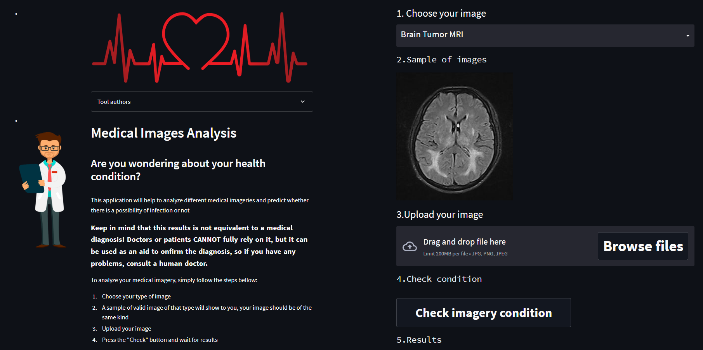

# 
Medical Imaging Analysis
  
  

Analyzing medical images and getting information and insights from it is a very useful and helpful way to monitor the patient's condition and the ability to predict the possibility of contracting a disease, the greater the amount of data and information collected for each patient, the greater the possibility of diagnosing this patient more efficiently and the extent of the possibility of contracting any disease.

## General Info  
- In this project we tried to provide multiple and different medical imaging analysis with simple tool to predict the probability of being infected with a disease related to this medical image.
- This project was created as a **final project** of  Samsung Innovation Campus (SIC) AI training.
- The application construct is located in the `app.py` file. This file gets input from the user, process it to the appropriate form and use the pretrained models from `Models h5` folder to predict and analyze images.

  
  

## Modelling and Results
- All datasets has been processed, modelled and evaluated through a single pipeline.
- Transfer learning technique was used to increase model efficiency, **InceptionV3** model is used with finetuning to better fit and generalize with different data.
- Medical images in real world differ in size, angle, illumination, ..., so Train-time augmentation and Test-time augmentation were used to increase data diversity, prevent overfitting and to help the model be more accurate with different images
- All the metrics evaluation can be found in `Test evaluation metrics` folder

## Team Members  
- [Ahmed Mohsen](https://github.com/PrinceEGY)
- [Yomna Ramdan](https://github.com/Yomna-Ramadan)  

## Technologies  
- The app is fully written in `Python 3.10.1`, the user interface was created using `streamlit 1.13.0`
- Libraries used: `TensorFlow`, `Keras`, `numpy`, `seaborn`, `matplotlib`, `sklearn`, `PIL`, `OpenCV`

 

----
